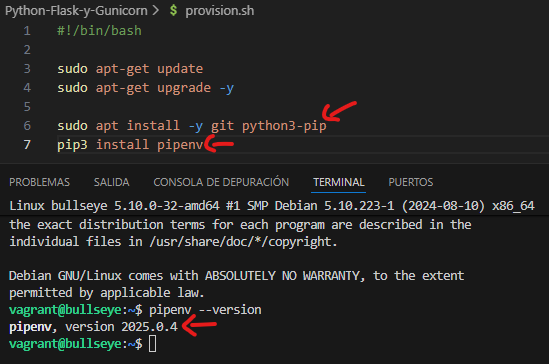
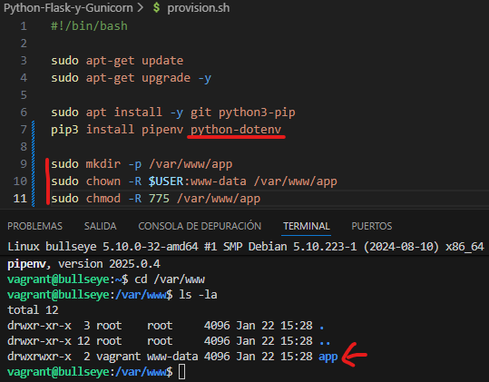
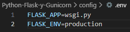
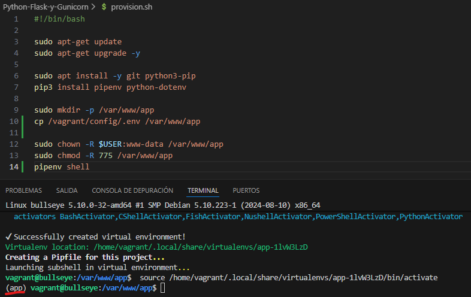
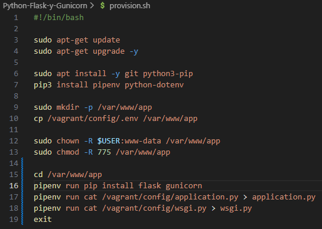
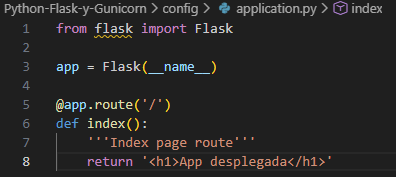
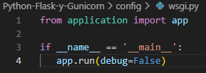
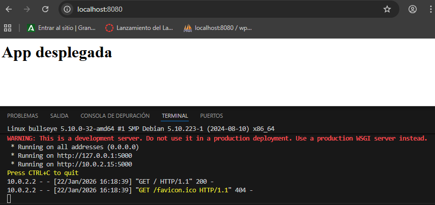
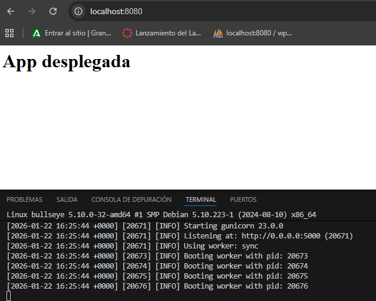

# Práctica de Python, Flask y Gunicorn
## Instalación de Python PIP
Instalamos **python3-pip**, y luego instalamos con ese paquete **pipenv**
 

### Instalación de python-dotenv y preparación del directorio de la app
Instalamos **python-dotenv** con PIP y preparamos el dirtectorio de la app
 

## Configuración y lanzamiento del entorno virtual
Configuramos el entorno virtual con el archivo .env, que debe quedar así
 

Y lanzamos el entorna virtual con **pipenv shell**
 

## Flask, Gunicorn y archivos de la app
Instalamos **Flask** y **Gunicorn**, y creamos los archivos **application.py** (la app en sí) y **wsgi.py** (para iniciarla y se quede corriendo)
 
¡Nota, se ha usado **pipenv run** y **cat** para crear los archivos para provisionarlos sin problemas de permisos y porque vagrant no soporta pipenv shell en la provisión!
 

Application.py
 

Wsgi.py
 

## Comprobación de funcionamiento
¡Nota, vagrant tiene configurado que el puerto del hoster es :8080, tampoco se pueden mantener abiertas (con estos comandos) y son omitidas de la provision!
 
Probamos que funciona con:

Flask (con el comando **flask run --host '0.0.0.0'**)
 

Gunicorn (con el comando **gunicorn --workers 4 --bind 0.0.0.0:5000 wsgi:app**)
 
