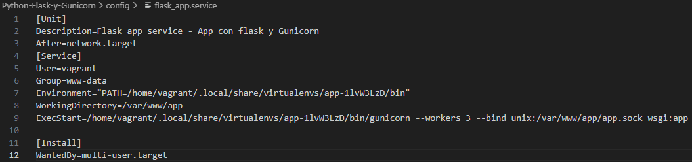
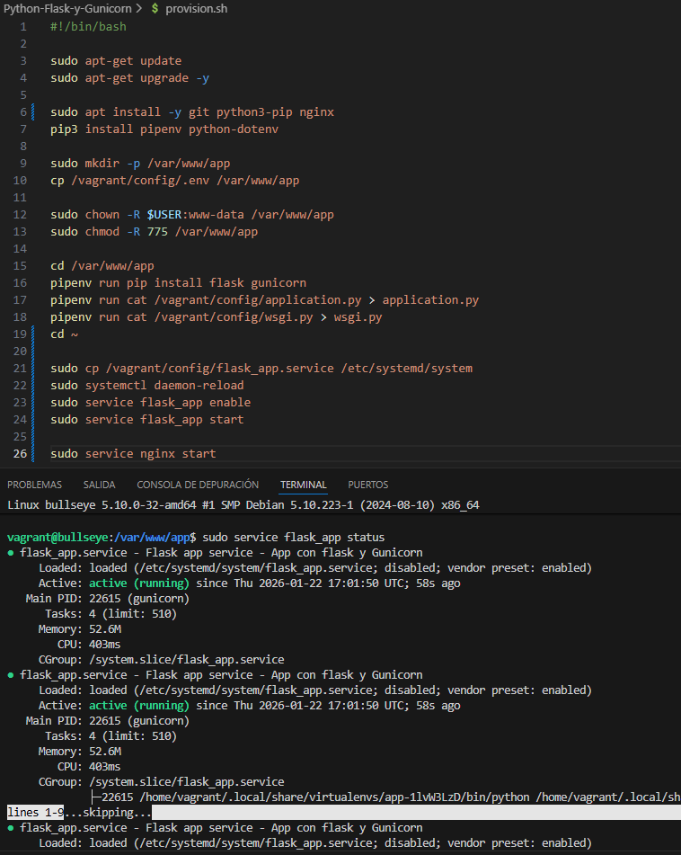
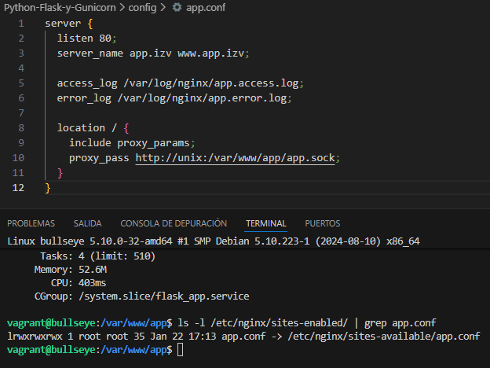
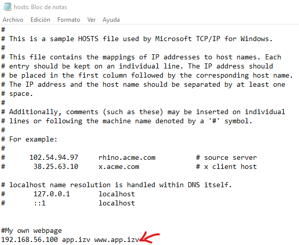
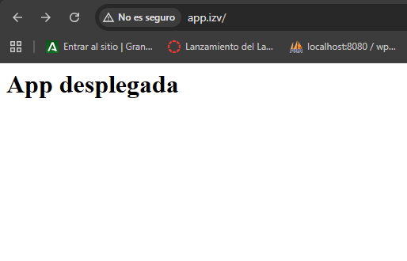

# Práctica de Python, Flask y Gunicorn
## Instalación de Python PIP
Instalamos **python3-pip**, y luego instalamos con ese paquete **pipenv**
 

### Instalación de python-dotenv y preparación del directorio de la app
Instalamos **python-dotenv** con PIP y preparamos el dirtectorio de la app
 

## Configuración y lanzamiento del entorno virtual
Configuramos el entorno virtual con el archivo .env, que debe quedar así
 

Y lanzamos el entorna virtual con **pipenv shell**
 

## Flask, Gunicorn y archivos de la app
Instalamos **Flask** y **Gunicorn**, y creamos los archivos **application.py** (la app en sí) y **wsgi.py** (para iniciarla y se quede corriendo)
 
¡Nota, se ha usado **pipenv run** y **cat** para crear los archivos para provisionarlos sin problemas de permisos y porque vagrant no soporta pipenv shell en la provisión!
 

Application.py
 

Wsgi.py
 

## Comprobación de funcionamiento
¡Nota, vagrant tiene configurado que el puerto del hoster es :8080, tampoco se pueden mantener abiertas (con estos comandos) y son omitidas de la provision!
 
Probamos que funciona con:

Flask (con el comando **flask run --host '0.0.0.0'**)
 

Gunicorn (con el comando **gunicorn --workers 4 --bind 0.0.0.0:5000 wsgi:app**)
 

## Creación y ejecución de un servicio para Gunicorn
¡Nota, en el extremo caso de que alguna ruta de Gunicorn cambie, reemplaza las rutas por la que te dé con el comando **which gunicorn** EN el entorno virtual de **pipenv**!
 
Creamos el archivo **flask_app.service** en **/etc/systemd/system**
 

Para lanzarlo, primero recargamos los servicios con **sudo systemctl daemon-reload**
 
Luego activamos y comprobamos que el servicio funciona correctamente con **sudo service flask_app [action]**
 

## Configuración de Nginx para ver la app en funcionamiento
Creamos el archivo **app.conf** en **/etc/nginx/sites-available**, hacer el link en **sites-enabled** con **sudo ln -s /etc/nginx/sites-available/app.conf /etc/nginx/sites-enabled** y tiene que quedar algo así
 

### App lanzada
¡Nota, se requiere resolver los nombres, en nuestro caso vamos a usar el archivo **C:\Windows\System32\drivers\etc\hosts** (**/etc/hosts** en Linux)!
 

La app nos quedará así (si has hecho personalmente la provisión, intenta acceder a [http://app.izv](http://app.izv))
 
